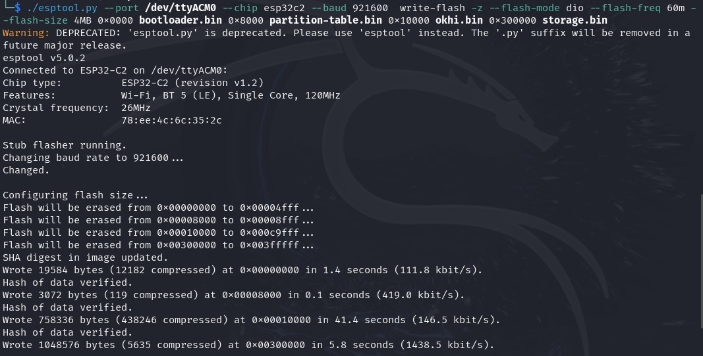
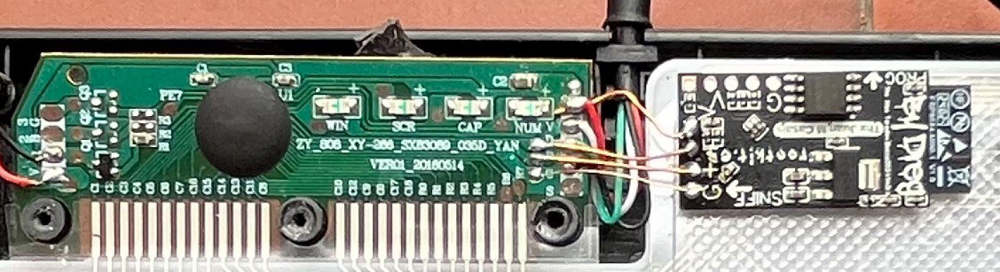
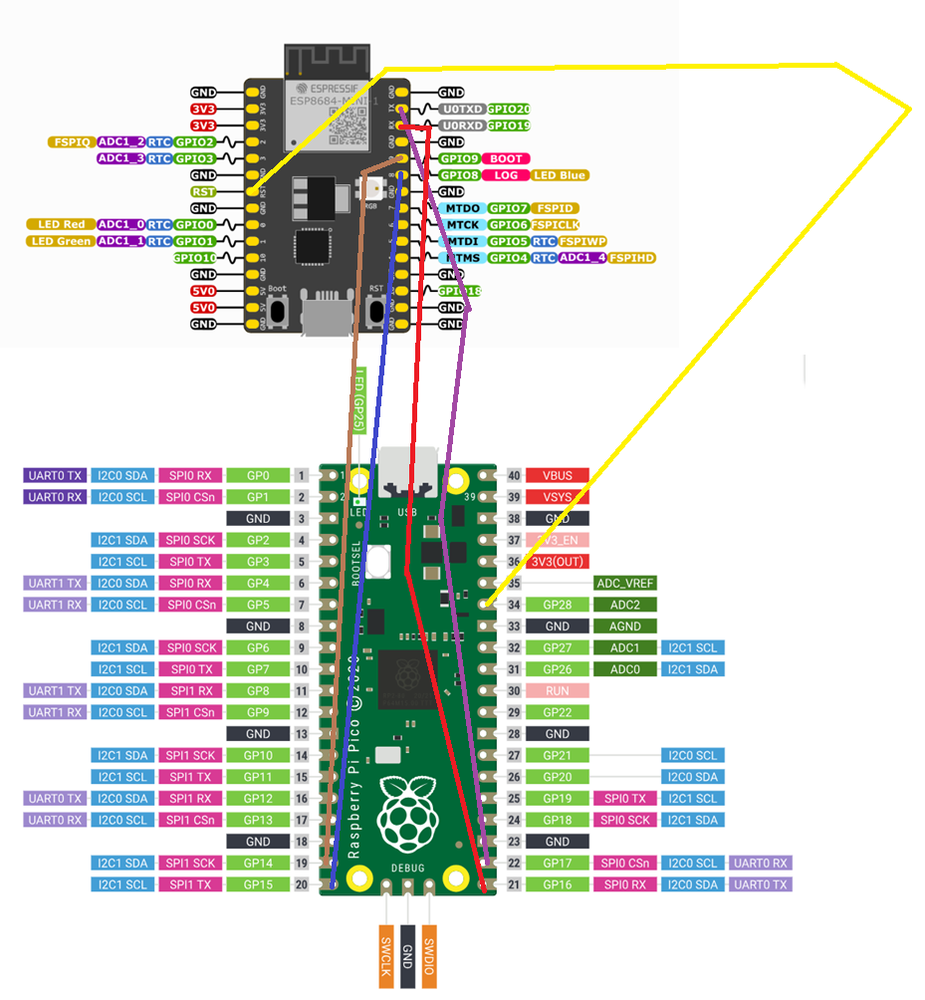

# Raspberry Pi Pico UART-USB flasher for ESP

This program leverages the Raspberry Pi Pico's hardware UART to create an independent USB CDC serial device, effectively functioning as a USB-to-UART bridge controller. It is particularly useful for flashing ESP8266 and ESP32 devices over USB. The implementation supports ELOG, RTS (CHIP_PU) and CTS (EBOOT) signals, ensuring reliable and stable flashing operations.

The firmware is compatible with both Windows and Linux and works seamlessly with the latest versions of esptool. For more information, visit the official esptool repository: https://github.com/espressif/esptool

This project is the Dreg's fork of the `pico-uart-bridge` created by Álvaro Fernández Rojas (@Noltari). You can find the original repository here: https://github.com/Noltari/pico-uart-bridge

I created this project to ensure that all the effort I put into my okhi project (Open Keylogger Hardware Implant - USB & PS2 Keyboards) can benefit more people: https://github.com/therealdreg/okhi

The okhi implant is programmed through a single USB port, utilizing the USB interface of the RP2040 both to program itself and to act as a bridge for flashing the onboard ESP-C2 chip. This firmware is perfectly suited for such applications, providing a streamlined and efficient solution for dual-purpose programming and flashing tasks. 

In the okhi repository, you can find an example schematic showing how to connect the components.

# Download last firmware
Download the latest firmware from the releases section:

https://github.com/therealdreg/pico-esp-flasher/releases/latest

# Flashing the firmware
To flash the firmware, you need to put the Raspberry Pi Pico in bootloader mode. To do this, press and hold the button while connecting the USB cable to the PC. The Pico will appear as a USB mass storage device. Drag and drop the pico_esp_flasher.uf2" firmware file to the Pico.

# Connections

| Raspberry Pi Pico GPIO | Function |
|:----------------------:|:--------:|
| GPIO16 (Pin 21)        | Pi's TX |
| GPIO17 (Pin 22)        | Pi's RX |
| GPIO28 (Pin 34)        | ESP's BOOT / CHIP PU / EN PIN |
| GPIO14 (Pin 19)        | ESP's EBOOT |
| GPIO15 (Pin 20)        | ESP's ELOG |
| GPIO26 (Pin 31)        | OKHI LED |

## Example ESP8684-DevKitM-1-H4

Connect the components as shown, and you'll be able to use esptool over the USB port created by the Raspberry Pi Pico. This setup ensures a reliable connection for flashing your ESP device, leveraging the Pico's USB-to-UART bridge functionality.

# Related 

- https://github.com/therealdreg/okhi
- https://github.com/Noltari/pico-uart-bridge
- https://github.com/espressif/esptool